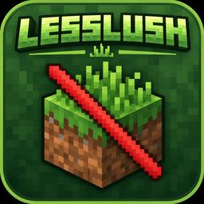

  

# Lush Grass

Lush Grass is a lightweight client-side visual mod that makes grass blocks and grassy landscapes look more natural and lush while preserving the vanilla style.

## Features

- Enhances vanilla grass blocks so grasslands look lusher while retaining the vanilla style.
- Provides a connected-texture appearance for grass blocks, creating more
  natural visual transitions between adjacent grass blocks.
- Provides complete snowy grass-block coverage for a cleaner appearance in snowy environments.
- Renders grass tufts on unobstructed grass blocks to add depth and variety to grasslands.
- Provides client-side configuration with independent controls for grass-block coverage and grass-tuft rendering.

## Requirements

- Minecraft 1.21.1
- NeoForge 21.1.152 or newer

## Configuration

The client configuration is stored in `config/lush_grass-client.toml`.

| Option | Default | Description |
| --- | --- | --- |
| `visuals.full_grass_block_coverage` | `true` | Improves vanilla grass blocks with continuous grass coverage. |
| `visuals.render_grass_tufts` | `true` | Renders short grass on unobstructed vanilla grass blocks. |

Changing either option refreshes the affected chunks.

## License

- Lush Grass is licensed under the [MIT License](LICENSE).
- Third-party notices: [NOTICE](NOTICE)
