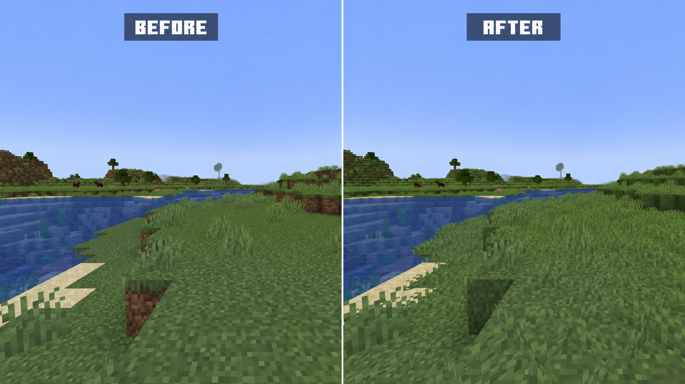

  

# Lush Grass

Lush Grass is a lightweight client-side visual mod that makes grass blocks and
grassy landscapes look more natural and lush while preserving the vanilla style.

## Features

- Improves the appearance of vanilla grass blocks, making grasslands look lusher.
- Renders grass tufts on unobstructed grass blocks to add depth to grasslands.
- Provides client-side configuration with independent controls for grass-block
  coverage and grass-tuft rendering.
- Supports popular rendering optimization and shader mods, giving grass tufts
  the correct shader materials and vegetation movement.

## Requirements

- Minecraft 26.2
- Fabric Loader 0.19.3 or newer
- Fabric API 0.155.2+26.2 or newer

## Configuration

With Mod Menu installed, open **Mods > Lush Grass > Configure**, then select
**Visuals** to change the two rendering options in game.

The client configuration is stored in `config/lush_grass-client.json`.

| Option | Default | Description |
| --- | --- | --- |
| `full_grass_block_coverage` | `true` | Improves vanilla grass blocks with continuous grass coverage. |
| `render_grass_tufts` | `true` | Renders short grass on unobstructed vanilla grass blocks. |

Changing either option refreshes the affected chunks.

## License

- Lush Grass is licensed under the [MIT License](LICENSE).
- Third-party notices: [NOTICE](NOTICE)

Patchy wilderness tufts: decorative grass now uses deterministic noise + position hashing, so not every grass block gets a tuft.
